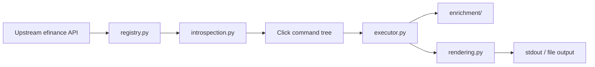

# efinance-cli

<div align="center">

<p><strong>Agent-friendly CLI for the <code>efinance</code> Python package</strong></p>

<p>
  Expose upstream market-data APIs as a predictable command tree,
  normalize output into table / JSON / CSV / TSV,
  and enrich market data with technical indicators when the result shape allows it.
</p>

<table>
  <tr>
    <td><strong>Python</strong></td>
    <td><code>&gt;= 3.13</code></td>
    <td><strong>Primary entrypoints</strong></td>
    <td><code>efinance</code>, <code>efi</code></td>
  </tr>
  <tr>
    <td><strong>Core stack</strong></td>
    <td><code>click</code>, <code>efinance</code>, <code>pandas</code>, <code>vortezwohl</code></td>
    <td><strong>Docs</strong></td>
    <td><code>README</code> + <code>i18n/</code></td>
  </tr>
</table>

</div>

This project is a command-line product layer around `efinance`, not a thin script bundle. It keeps the surface area explicit and stable by separating command discovery, parameter introspection, execution, rendering, and data enrichment into distinct modules.

## Why this exists

`efinance` already provides a large Python API surface for stocks, funds, bonds, futures, common market queries, and utility lookups. The problem is not capability. The problem is operational consistency:

- API functions are hard to browse quickly from a terminal.
- Different return types need different presentation rules.
- Repeated manual wiring becomes brittle when upstream adds or changes functions.
- Watch-style refresh loops should work consistently across query commands.
- Some result types can be enriched with technical indicators, but only when the data shape supports it.

`efinance-cli` solves those problems by turning the upstream API into an opinionated terminal interface that is easier for humans and agents to use repeatedly.

## At a glance

<table>
  <thead>
    <tr>
      <th>Layer</th>
      <th>Responsibility</th>
    </tr>
  </thead>
  <tbody>
    <tr>
      <td><code>registry.py</code></td>
      <td>Curates the exposed upstream module and function list, and attaches command metadata.</td>
    </tr>
    <tr>
      <td><code>introspection.py</code></td>
      <td>Derives Click parameters from Python signatures and performs lightweight type coercion.</td>
    </tr>
    <tr>
      <td><code>executor.py</code></td>
      <td>Runs command requests, applies watch loops, and routes output to stdout or files.</td>
    </tr>
    <tr>
      <td><code>rendering.py</code></td>
      <td>Normalizes DataFrame / Series / dict / list / tuple / set / dataclass / namedtuple output.</td>
    </tr>
    <tr>
      <td><code>enrichment/</code></td>
      <td>Adds technical indicators to compatible history, latest, and realtime results.</td>
    </tr>
  </tbody>
</table>

## Installation

```bash
pip install efinance-cli
```

The project targets Python 3.13+ and expects the upstream `efinance` package to be available at runtime. It also depends on `pandas`, because output normalization and indicator enrichment are DataFrame-first by design.

If you are developing from source, create or activate the project environment first and then install dependencies from the project metadata.

## Quick start

### Discover a quote

```bash
efinance search 贵州茅台
efinance search PG --count 10 --format json
efinance search 腾讯 --market Hongkong
```

`search` is the safest entrypoint for users and agents that do not already know the exact quote identifier. The command uses local search when available unless `--no-cache` is set.

### Query market data

```bash
efinance stock get-base-info 600519
efinance stock get-quote-history 600519 --beg 20250101 --end 20250501 --full
efinance fund get-base-info 161725
efinance common get-latest-quote 600519
```

### Refresh in place

```bash
efinance stock get-realtime-quotes --watch --interval 2
efinance watch --interval 5 stock get-realtime-quotes
```

The top-level `watch` command wraps any supported subcommand and forwards refresh settings in a uniform way. This is useful when you want one refresh policy for many different query types.

## Command surface

The CLI exposes a curated subset of the upstream `efinance` API.
Command names are derived from Python function names by converting underscores to hyphens:

- `get_quote_history` → `get-quote-history`
- `get_realtime_increase_rate` → `get-realtime-increase-rate`
- `get_realtime_quotes_by_fs` → `get-realtime-quotes-by-fs`

### Top-level commands

<table>
  <thead>
    <tr>
      <th>Command</th>
      <th>Purpose</th>
    </tr>
  </thead>
  <tbody>
    <tr>
      <td><code>search</code></td>
      <td>Search securities by keyword and optional market filter.</td>
    </tr>
    <tr>
      <td><code>watch</code></td>
      <td>Wrap any supported subcommand with a refresh loop.</td>
    </tr>
    <tr>
      <td><code>stock</code></td>
      <td>Stock market queries.</td>
    </tr>
    <tr>
      <td><code>fund</code></td>
      <td>Fund market queries.</td>
    </tr>
    <tr>
      <td><code>bond</code></td>
      <td>Bond market queries.</td>
    </tr>
    <tr>
      <td><code>futures</code></td>
      <td>Futures market queries.</td>
    </tr>
    <tr>
      <td><code>common</code></td>
      <td>Shared query entrypoints across multiple asset types.</td>
    </tr>
    <tr>
      <td><code>utils</code></td>
      <td>Search and identifier utilities.</td>
    </tr>
  </tbody>
</table>

### Module command groups

<details open>
<summary><strong>stock</strong></summary>

- `get-all-company-performance`
- `get-all-report-dates`
- `get-base-info`
- `get-belong-board`
- `get-daily-billboard`
- `get-deal-detail`
- `get-history-bill`
- `get-latest-holder-number`
- `get-latest-ipo-info`
- `get-latest-quote`
- `get-members`
- `get-quote-history`
- `get-quote-snapshot`
- `get-realtime-quotes`
- `get-today-bill`
- `get-top10-stock-holder-info`

</details>

<details>
<summary><strong>fund</strong></summary>

- `get-base-info`
- `get-fund-codes`
- `get-fund-manager`
- `get-industry-distribution`
- `get-invest-position`
- `get-pdf-reports`
- `get-period-change`
- `get-public-dates`
- `get-quote-history`
- `get-quote-history-multi`
- `get-realtime-increase-rate`
- `get-types-percentage`

</details>

<details>
<summary><strong>bond</strong></summary>

- `get-all-base-info`
- `get-base-info`
- `get-deal-detail`
- `get-history-bill`
- `get-quote-history`
- `get-realtime-quotes`
- `get-today-bill`

</details>

<details>
<summary><strong>futures</strong></summary>

- `get-deal-detail`
- `get-futures-base-info`
- `get-quote-history`
- `get-realtime-quotes`

</details>

<details>
<summary><strong>common</strong></summary>

- `get-base-info`
- `get-deal-detail`
- `get-history-bill`
- `get-latest-quote`
- `get-quote-history`
- `get-realtime-quotes-by-fs`
- `get-today-bill`

</details>

<details>
<summary><strong>utils</strong></summary>

- `add-market`
- `get-quote-id`
- `search-quote`
- `search-quote-locally`

</details>

## Output model

Every command is rendered through one of four output modes:

<table>
  <thead>
    <tr>
      <th>Format</th>
      <th>Best for</th>
      <th>Behavior</th>
    </tr>
  </thead>
  <tbody>
    <tr>
      <td><code>table</code></td>
      <td>Interactive terminal reading</td>
      <td>Default mode. Uses a console-friendly table representation for DataFrame-like results.</td>
    </tr>
    <tr>
      <td><code>json</code></td>
      <td>Structured downstream processing</td>
      <td>Serializes DataFrame, Series, dict, dataclass, and namedtuple results into JSON.</td>
    </tr>
    <tr>
      <td><code>csv</code></td>
      <td>Persistence and interoperability</td>
      <td>Writes comma-separated output while respecting index and transpose settings.</td>
    </tr>
    <tr>
      <td><code>tsv</code></td>
      <td>Spreadsheet-friendly export</td>
      <td>Same as CSV, but uses tab separation.</td>
    </tr>
  </tbody>
</table>

Shared output flags:

- `--full`
- `--transpose`
- `--no-index`
- `--limit N`
- `--output PATH`
- `--encoding utf-8`

These options are applied uniformly across the command tree so agents do not need to re-learn output behavior for every module.

## Watch model

Watch support is built into the executor, not copied into every command.

Supported commands can be refreshed in place with:

```bash
efinance stock get-realtime-quotes --watch --interval 2
```

Or wrapped explicitly:

```bash
efinance watch --interval 2 stock get-realtime-quotes
efinance watch --interval 10 fund get-realtime-increase-rate 161725 005827
```

Shared watch flags:

- `--watch`
- `--interval FLOAT`
- `--count INT`
- `--clear / --no-clear`

The `watch` wrapper is especially useful when you want a consistent refresh policy across many subcommands without repeating flags everywhere.

## Technical-indicator enrichment

`enrichment/` adds technical indicators when the output shape contains enough price history or realtime rows to support them.

### Indicator levels

<table>
  <thead>
    <tr>
      <th>Level</th>
      <th>Alias</th>
      <th>History window</th>
      <th>Realtime limit</th>
      <th>Typical use</th>
    </tr>
  </thead>
  <tbody>
    <tr>
      <td><code>basic</code></td>
      <td><code>1</code></td>
      <td>60</td>
      <td>50</td>
      <td>Core moving-average and oscillator set.</td>
    </tr>
    <tr>
      <td><code>advanced</code></td>
      <td><code>2</code></td>
      <td>120</td>
      <td>80</td>
      <td>Trend-strength and channel-style extensions.</td>
    </tr>
    <tr>
      <td><code>full</code></td>
      <td><code>3</code></td>
      <td>200</td>
      <td>120</td>
      <td>Broader indicator coverage, including Ichimoku, SAR, pivots, Fibonacci, and support/resistance.</td>
    </tr>
  </tbody>
</table>

### Where enrichment applies

- History K-line results for stock, bond, futures, common, and fund history commands.
- Single-row snapshot results such as stock snapshot or base-info style outputs.
- Latest quote results.
- Realtime list results, subject to the configured limit.

Enrichment is intentionally conservative. It only adds indicator columns when a compatible source series or frame is available. If the upstream result cannot be mapped cleanly to OHLCV-style data, the original result is returned unchanged.

### What gets added

The project ships a large indicator set, grouped by concern:

- trend indicators: MACD, Bollinger Bands, DMI / ADX, SuperTrend, Ichimoku, Donchian, Keltner, Aroon, Parabolic SAR
- momentum indicators: RSI, KDJ, ROC, CCI, PPO, TRIX, TSI, Williams %R
- volume indicators: OBV, MFI, CMF, PVT, VWAP, force index, volume ratio
- volatility indicators: ATR, NATR, historical volatility, Chaikin volatility, Mass Index
- price structure indicators: pivot points, Fibonacci retracement, rolling support / resistance
- Chinese-market style indicators: BBI, BIAS, BRAR, CR, DMA, EMV, MTM, PSY, VR, ASI

## Recommended workflow

When you do not know the exact identifier, use the discovery path first:

```text
search -> get-quote-id -> module query
```

This avoids most keyword ambiguity and is the most reliable path for agents that operate from a natural-language intent.

## Project architecture

<details open>
<summary><strong>How the pipeline works</strong></summary>



</details>

### File-level responsibilities

<table>
  <thead>
    <tr>
      <th>File / package</th>
      <th>Role</th>
    </tr>
  </thead>
  <tbody>
    <tr>
      <td><code>efinance_cli/main.py</code></td>
      <td>Process entrypoint.</td>
    </tr>
    <tr>
      <td><code>efinance_cli/app.py</code></td>
      <td>Application assembly.</td>
    </tr>
    <tr>
      <td><code>efinance_cli/commands.py</code></td>
      <td>Root command, module groups, and top-level commands.</td>
    </tr>
    <tr>
      <td><code>efinance_cli/registry.py</code></td>
      <td>Exposed upstream modules, white-listing, and command metadata.</td>
    </tr>
    <tr>
      <td><code>efinance_cli/introspection.py</code></td>
      <td>Signature-driven Click parameter synthesis.</td>
    </tr>
    <tr>
      <td><code>efinance_cli/executor.py</code></td>
      <td>Request execution, watch looping, and result emission.</td>
    </tr>
    <tr>
      <td><code>efinance_cli/rendering.py</code></td>
      <td>Output formatting and serialization.</td>
    </tr>
    <tr>
      <td><code>efinance_cli/enrichment/</code></td>
      <td>Technical indicator enrichment pipeline.</td>
    </tr>
    <tr>
      <td><code>efinance_cli/indicators/</code></td>
      <td>Reusable indicator math primitives.</td>
    </tr>
  </tbody>
</table>

## Data-source notes

This CLI is only as stable as the upstream market data source it wraps.
You should assume that live queries can fail for reasons outside the CLI itself:

- temporary network failures
- upstream rate limiting
- empty responses
- market-specific outages

The CLI does not hide those failures. Instead, it keeps the execution path explicit so you can retry, reduce refresh frequency, or switch to a different query type as needed.

## Quality bar

The repository includes smoke tests for:

- technical-indicator exports and shapes
- enrichment behavior for basic / advanced / full indicator levels

The tests intentionally focus on the minimal contract that keeps the command layer and enrichment layer from regressing silently.

## Extending the CLI

If you want to extend the project, the safest path is:

1. Add or adjust the exposed upstream function list in `registry.py`.
2. Add or normalize help text if the upstream docstring is incomplete or unstable.
3. Update `introspection.py` if a new parameter type needs a new coercion rule.
4. Add a renderer in `rendering.py` if the result shape is new.
5. Update `enrichment/` if the command family should gain indicator augmentation.
6. Add or update smoke tests for the new surface.

This keeps change localized and prevents the command tree from turning into a single monolithic file.

## Documentation in other languages

<table>
  <thead>
    <tr>
      <th>Language</th>
      <th>File</th>
    </tr>
  </thead>
  <tbody>
    <tr>
      <td>Simplified Chinese</td>
      <td><a href="i18n/README.zh-CN.md">i18n/README.zh-CN.md</a></td>
    </tr>
    <tr>
      <td>Traditional Chinese</td>
      <td><a href="i18n/README.zh-TW.md">i18n/README.zh-TW.md</a></td>
    </tr>
  </tbody>
</table>

## Further reading

- [CLI design notes](docs/cli-设计与使用说明.md)
- [Architecture design notes](docs/架构设计说明.md)

## License

See [LICENSE](LICENSE).
