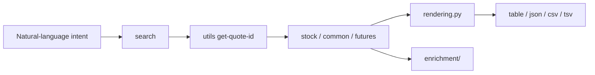
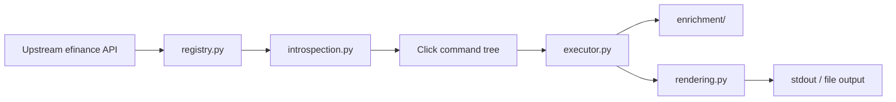

# efinance-cli

<div align="center">
  <h1>efinance-cli</h1>
  <p><strong>Turn <code>efinance</code> into a terminal interface that is easier for humans and agents to reuse</strong></p>
  <p>Explicit command tree, unified output layer, reusable watch workflow, and optional technical-indicator enrichment.</p>
  <p>
    <a href="https://www.python.org/"></a>
    <a href="https://pypi.org/project/click/"></a>
    <a href="https://pypi.org/project/efinance/"></a>
    <a href="https://pandas.pydata.org/"></a>
  </p>
  <p>
    <a href="#30-second-start">30-second start</a> ·
    <a href="#us-stock-examples">US stock examples</a> ·
    <a href="#command-map">Command map</a> ·
    <a href="#indicator-enrichment">Indicator enrichment</a> ·
    <a href="#project-architecture">Project architecture</a>
  </p>
</div>

<p align="center"><strong>English | <a href="i18n/README.zh-CN.md">简体中文</a> | <a href="i18n/README.zh-TW.md">繁體中文</a></strong></p>

<table>
  <tr>
    <td width="33%" valign="top">
      <strong>Predictable</strong><br />
      Command names map directly to upstream functions, which makes discovery, scripting, and agent orchestration easier.
    </td>
    <td width="33%" valign="top">
      <strong>Consumable</strong><br />
      Every result lands in <code>table / json / csv / tsv</code>, so you do not need a different post-processing path for every shape.
    </td>
    <td width="33%" valign="top">
      <strong>Extensible</strong><br />
      Discovery, parameter reflection, execution, rendering, and enrichment stay separated so the CLI can evolve locally instead of turning monolithic.
    </td>
  </tr>
</table>

## What This Is

> `efinance-cli` is not a loose script bundle. It is a command-line product layer built on top of `efinance`.

It compresses the upstream market-data API surface into an explicit command tree, while separating command discovery, parameter introspection, execution, rendering, and technical-indicator enrichment into distinct modules. The goal is not to replace the market library. The goal is to make the existing capability more stable and reusable from a terminal.

## 30-Second Start

<table>
  <tr>
    <td width="33%" valign="top">
      <strong>1. Search first</strong>
      <pre lang="bash"><code>efinance search AAPL --market US_stock --result-count 5 --format json</code></pre>
      If you only know the ticker or company name, the search entrypoint is the safest place to start.
    </td>
    <td width="33%" valign="top">
      <strong>2. Resolve quote_id</strong>
      <pre lang="bash"><code>efinance utils get-quote-id AAPL</code></pre>
      Common US stocks resolve into a unified identifier such as <code>105.AAPL</code>.
    </td>
    <td width="33%" valign="top">
      <strong>3. Query data</strong>
      <pre lang="bash"><code>efinance stock get-quote-history AAPL --market-type us_stock --beg 20250102 --end 20250501 --limit 20</code></pre>
      You can keep going from there for history, latest quotes, exports, and downstream processing.
    </td>
  </tr>
</table>

## Why Not Call the Upstream API Directly

<table>
  <tr>
    <td width="50%" valign="top">
      <strong>The issue is not missing capability</strong>
      <ul>
        <li>The upstream function surface is large and not easy to browse from a terminal.</li>
        <li>Different return types need different presentation rules.</li>
        <li>Cross-cutting concerns like watch, export, transpose, and row limits get rewired repeatedly.</li>
        <li>Indicator enrichment only makes sense when the result shape is compatible enough.</li>
      </ul>
    </td>
    <td width="50%" valign="top">
      <strong>The CLI solves for stable operational use</strong>
      <ul>
        <li>It turns API capability into a navigable command tree.</li>
        <li>It centralizes output behavior in one rendering layer.</li>
        <li>It implements watch as a shared executor feature.</li>
        <li>It keeps enrichment conservative and shape-aware.</li>
      </ul>
    </td>
  </tr>
</table>

## US Stock Examples

<details open>
<summary><strong>Discovery and identifier resolution</strong></summary>

```bash
efinance search AAPL --market US_stock --result-count 5
efinance search NVDA --market US_stock --format json
efinance utils get-quote-id AAPL
```

</details>

<details open>
<summary><strong>History and export</strong></summary>

```bash
efinance stock get-quote-history AAPL --market-type us_stock --beg 20250102 --end 20250501 --limit 20
efinance stock get-quote-history MSFT --market-type us_stock --beg 20250102 --end 20250501 --format csv --output msft-history.csv
efinance stock get-quote-history TSLA --market-type us_stock --beg 20250102 --end 20250501 --indicator-level advanced --full
```

</details>

<details open>
<summary><strong>Latest quote and watch loop</strong></summary>

```bash
efinance common get-latest-quote 105.AAPL --format json
efinance watch --interval 5 common get-latest-quote 105.NVDA --format json
efinance common get-latest-quote 105.MSFT --format json --output msft-latest.json
```

</details>

<details>
<summary><strong>Output controls</strong></summary>

```bash
efinance stock get-quote-history AAPL --market-type us_stock --beg 20250102 --end 20250501 --transpose
efinance stock get-quote-history AAPL --market-type us_stock --beg 20250102 --end 20250501 --no-index
efinance stock get-quote-history AAPL --market-type us_stock --beg 20250102 --end 20250501 --format tsv --output aapl.tsv
```

</details>

<blockquote>
  Note: realtime quote stability depends on the upstream market-data source. The CLI keeps failure states visible instead of hiding network volatility.
</blockquote>

## Command Map

<table>
  <thead>
    <tr>
      <th align="left">Top-level command</th>
      <th align="left">Role</th>
      <th align="left">Typical use</th>
    </tr>
  </thead>
  <tbody>
    <tr>
      <td><code>search</code></td>
      <td>Search securities by keyword and optional market enum.</td>
      <td>The first stop when you do not know the exact identifier yet.</td>
    </tr>
    <tr>
      <td><code>watch</code></td>
      <td>Wrap any supported subcommand with a refresh loop.</td>
      <td>One polling policy across many commands.</td>
    </tr>
    <tr>
      <td><code>stock</code></td>
      <td>Stock-oriented queries.</td>
      <td>History, snapshots, latest quote, flows, holder data.</td>
    </tr>
    <tr>
      <td><code>fund</code></td>
      <td>Fund-oriented queries.</td>
      <td>Net value, estimated move, positions, report download.</td>
    </tr>
    <tr>
      <td><code>bond</code></td>
      <td>Bond-oriented queries.</td>
      <td>Base info, quotes, historical trade and capital flow.</td>
    </tr>
    <tr>
      <td><code>futures</code></td>
      <td>Futures-oriented queries.</td>
      <td>Base info, realtime quotes, K-line, trade detail.</td>
    </tr>
    <tr>
      <td><code>common</code></td>
      <td>Shared cross-asset query entrypoints.</td>
      <td>Useful when you already know the <code>quote_id</code>.</td>
    </tr>
    <tr>
      <td><code>utils</code></td>
      <td>Search and identifier tooling.</td>
      <td><code>search-quote</code>, <code>get-quote-id</code>, <code>add-market</code>.</td>
    </tr>
  </tbody>
</table>

<details open>
<summary><strong>Module command groups</strong></summary>

<table>
  <tr>
    <td width="33%" valign="top">
      <strong>stock</strong><br />
      <code>get-base-info</code><br />
      <code>get-latest-quote</code><br />
      <code>get-quote-history</code><br />
      <code>get-quote-snapshot</code><br />
      <code>get-realtime-quotes</code><br />
      <code>get-deal-detail</code><br />
      <code>get-history-bill</code><br />
      <code>get-today-bill</code><br />
      <code>get-top10-stock-holder-info</code><br />
      <code>get-all-company-performance</code>
    </td>
    <td width="33%" valign="top">
      <strong>fund</strong><br />
      <code>get-base-info</code><br />
      <code>get-fund-codes</code><br />
      <code>get-fund-manager</code><br />
      <code>get-industry-distribution</code><br />
      <code>get-invest-position</code><br />
      <code>get-pdf-reports</code><br />
      <code>get-period-change</code><br />
      <code>get-public-dates</code><br />
      <code>get-quote-history</code><br />
      <code>get-realtime-increase-rate</code>
    </td>
    <td width="33%" valign="top">
      <strong>bond / futures / common / utils</strong><br />
      <code>bond.get-base-info</code><br />
      <code>bond.get-quote-history</code><br />
      <code>futures.get-futures-base-info</code><br />
      <code>futures.get-quote-history</code><br />
      <code>common.get-latest-quote</code><br />
      <code>common.get-quote-history</code><br />
      <code>utils.search-quote</code><br />
      <code>utils.search-quote-locally</code><br />
      <code>utils.get-quote-id</code><br />
      <code>utils.add-market</code>
    </td>
  </tr>
</table>

</details>

## Output Model

<table>
  <thead>
    <tr>
      <th align="left">Format</th>
      <th align="left">Best for</th>
      <th align="left">Behavior</th>
    </tr>
  </thead>
  <tbody>
    <tr>
      <td><code>table</code></td>
      <td>Direct terminal reading</td>
      <td>Default mode for DataFrame-like results.</td>
    </tr>
    <tr>
      <td><code>json</code></td>
      <td>Agent or script pipelines</td>
      <td>Best when the next step expects structured data.</td>
    </tr>
    <tr>
      <td><code>csv</code></td>
      <td>Persistence and exchange</td>
      <td>Useful for spreadsheets, scripts, and analysis workflows.</td>
    </tr>
    <tr>
      <td><code>tsv</code></td>
      <td>Spreadsheet-friendly export</td>
      <td>Same model as CSV, but tab-delimited.</td>
    </tr>
  </tbody>
</table>

Shared runtime flags:

- `--full`
- `--transpose`
- `--no-index`
- `--limit N`
- `--output PATH`
- `--encoding utf-8`

These flags stay consistent across the entire command tree.

## Watch Model

<table>
  <tr>
    <td width="50%" valign="top">
      <strong>Inline watch</strong>
      <pre lang="bash"><code>efinance common get-latest-quote 105.AAPL --watch --interval 5</code></pre>
    </td>
    <td width="50%" valign="top">
      <strong>Top-level wrapper</strong>
      <pre lang="bash"><code>efinance watch --interval 5 common get-latest-quote 105.AAPL --format json</code></pre>
    </td>
  </tr>
</table>

Shared watch flags:

- `--watch`
- `--interval FLOAT`
- `--count INT`
- `--clear / --no-clear`

## Indicator Enrichment

`enrichment/` adds indicator columns when the output shape is compatible enough for history, latest quotes, snapshots, and some realtime lists.

<table>
  <thead>
    <tr>
      <th align="left">Level</th>
      <th align="left">Alias</th>
      <th align="left">History window</th>
      <th align="left">Realtime limit</th>
      <th align="left">Typical use</th>
    </tr>
  </thead>
  <tbody>
    <tr>
      <td><code>basic</code></td>
      <td><code>1</code></td>
      <td>60</td>
      <td>50</td>
      <td>Moving averages, RSI, KDJ, MACD, and other core observations.</td>
    </tr>
    <tr>
      <td><code>advanced</code></td>
      <td><code>2</code></td>
      <td>120</td>
      <td>80</td>
      <td>Trend-strength, channel-style, and broader momentum indicators.</td>
    </tr>
    <tr>
      <td><code>full</code></td>
      <td><code>3</code></td>
      <td>200</td>
      <td>120</td>
      <td>Broader coverage including Ichimoku, SAR, pivots, Fibonacci, and support/resistance.</td>
    </tr>
  </tbody>
</table>

The built-in set is broadly grouped as:

- Trend: MACD, Bollinger Bands, DMI / ADX, SuperTrend, Ichimoku, Donchian, Keltner, Aroon, Parabolic SAR
- Momentum: RSI, KDJ, ROC, CCI, PPO, TRIX, TSI, Williams %R
- Volume: OBV, MFI, CMF, PVT, VWAP, Force Index, Volume Ratio
- Volatility: ATR, NATR, Historical Volatility, Chaikin Volatility, Mass Index
- Price structure: Pivot Points, Fibonacci Retracement, Rolling Support / Resistance

## Agent-Friendly Query Path



The stable path is:

```text
search -> get-quote-id -> module query -> structured output / file export
```

## Project Architecture

<details open>
<summary><strong>Execution pipeline</strong></summary>



</details>

<table>
  <thead>
    <tr>
      <th align="left">File / package</th>
      <th align="left">Role</th>
    </tr>
  </thead>
  <tbody>
    <tr>
      <td><code>efinance_cli/main.py</code></td>
      <td>Process entrypoint.</td>
    </tr>
    <tr>
      <td><code>efinance_cli/app.py</code></td>
      <td>Application assembly.</td>
    </tr>
    <tr>
      <td><code>efinance_cli/commands.py</code></td>
      <td>Root command, module groups, and top-level commands.</td>
    </tr>
    <tr>
      <td><code>efinance_cli/registry.py</code></td>
      <td>Whitelist and command metadata for exposed upstream capability.</td>
    </tr>
    <tr>
      <td><code>efinance_cli/introspection.py</code></td>
      <td>Signature-driven Click parameter synthesis.</td>
    </tr>
    <tr>
      <td><code>efinance_cli/executor.py</code></td>
      <td>Request execution, watch looping, and result emission.</td>
    </tr>
    <tr>
      <td><code>efinance_cli/rendering.py</code></td>
      <td>Output formatting and serialization.</td>
    </tr>
    <tr>
      <td><code>efinance_cli/enrichment/</code></td>
      <td>Technical-indicator enrichment on compatible results.</td>
    </tr>
    <tr>
      <td><code>efinance_cli/indicators/</code></td>
      <td>Reusable indicator math primitives.</td>
    </tr>
  </tbody>
</table>

## Data-Source Boundaries

<table>
  <tr>
    <td width="50%" valign="top">
      <strong>Outside direct CLI control</strong>
      <ul>
        <li>Temporary network failures</li>
        <li>Upstream rate limiting</li>
        <li>Empty responses</li>
        <li>Market-source instability</li>
      </ul>
    </td>
    <td width="50%" valign="top">
      <strong>CLI behavior</strong>
      <ul>
        <li>It does not silently hide failures.</li>
        <li>It keeps the error path visible for retries and diagnosis.</li>
        <li>Retry cadence and query fallback stay in caller control.</li>
      </ul>
    </td>
  </tr>
</table>

## How To Extend It

The safest extension path is:

1. Update the upstream function whitelist or help overrides in `registry.py`.
2. Extend `introspection.py` only when a new parameter type needs a coercion rule.
3. Extend `rendering.py` only when a new result shape appears.
4. Extend `enrichment/` only when a command family should gain indicator augmentation.
5. Add or update smoke tests for the changed surface.

## Quality Bar

The repository currently protects two minimal contracts:

- indicator exports and result shapes
- `basic / advanced / full` enrichment behavior

The goal is not to prove the trading semantics of every indicator. The goal is to reduce silent regressions in the command and enrichment layers.

## Related Docs

<table>
  <tr>
    <td width="50%" valign="top">
      <strong>Design notes</strong><br />
      <a href="docs/cli-设计与使用说明.md">CLI design and usage notes</a><br />
      <a href="docs/架构设计说明.md">Architecture notes</a>
    </td>
    <td width="50%" valign="top">
      <strong>Entrypoints</strong><br />
      <code>efinance</code><br />
      <code>efi</code>
    </td>
  </tr>
</table>

## License

See [LICENSE](LICENSE).
