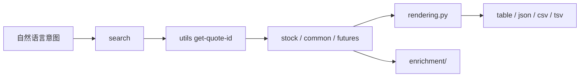
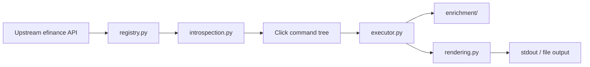

<div align="center">
  <h1>efinance-cli</h1>
  <p><strong>把 <code>efinance</code> 变成更适合人和 Agent 反复调用的终端界面</strong></p>
  <p>显式命令树、统一输出层、可复用刷新机制、按需叠加技术指标。</p>
  <p>
    <a href="https://www.python.org/"></a>
    <a href="https://pypi.org/project/click/"></a>
    <a href="https://pypi.org/project/efinance/"></a>
    <a href="https://pandas.pydata.org/"></a>
  </p>
  <p>
    <a href="#安装">安装</a> ·
    <a href="#语言版本">语言版本</a> ·
    <a href="#30-秒上手">30 秒上手</a> ·
    <a href="#美股示例">美股示例</a> ·
    <a href="#命令地图">命令地图</a> ·
    <a href="#技术指标增强">技术指标增强</a> ·
    <a href="#项目架构">项目架构</a>
  </p>
</div>

## 语言版本

<p align="center"><strong><a href="../README.md">English</a> | 简体中文 | <a href="README.zh-TW.md">繁體中文</a></strong></p>

<table>
  <tr>
    <td width="33%" valign="top">
      <strong>可预测</strong><br />
      命令名直接映射上游函数，适合快速检索、脚本调用和 Agent 自动拼装。
    </td>
    <td width="33%" valign="top">
      <strong>可消费</strong><br />
      所有结果统一落到 <code>table / json / csv / tsv</code>，不用为每类返回值重新适配。
    </td>
    <td width="33%" valign="top">
      <strong>可扩展</strong><br />
      命令发现、参数反射、执行、渲染、指标增强相互解耦，便于局部演进。
    </td>
  </tr>
</table>

## 安装

请从 PyPI 包 `the-efinance-cli` 安装。安装完成后可使用 `efinance` 和 `efi` 两个命令入口。

```bash
uv add -U the-efinance-cli
efinance --help
```

```bash
pip install -U the-efinance-cli
efinance --help
```

运行环境要求为 Python `3.10+`。

## 这是什么

> `efinance-cli` 不是一组零散脚本，而是套在 `efinance` 之上的命令行产品层。

它把上游市场数据 API 收束成一棵显式命令树，并把命令发现、参数解析、执行调度、结果渲染、技术指标增强拆成独立模块。目标不是“重新发明一个行情库”，而是把已有能力变成更稳定、更可重复调用的终端接口。

## 30 秒上手

<table>
  <tr>
    <td width="33%" valign="top">
      <strong>1. 先搜标的</strong>
      <pre lang="bash"><code>efinance search AAPL --market US_stock --result-count 5 --format json</code></pre>
      当你只知道股票代码或公司简称时，先走搜索入口最稳。
    </td>
    <td width="33%" valign="top">
      <strong>2. 再拿 quote_id</strong>
      <pre lang="bash"><code>efinance utils get-quote-id AAPL</code></pre>
      常见美股会拿到类似 <code>105.AAPL</code> 这样的统一标识。
    </td>
    <td width="33%" valign="top">
      <strong>3. 再做查询</strong>
      <pre lang="bash"><code>efinance stock get-quote-history AAPL --market-type us_stock --beg 20250102 --end 20250501 --limit 20</code></pre>
      历史 K 线、最新行情、导出文件都可以沿着这条链路继续走。
    </td>
  </tr>
</table>

## 为什么不是直接用上游 API

<table>
  <tr>
    <td width="50%" valign="top">
      <strong>上游问题不在能力，而在操作一致性</strong>
      <ul>
        <li>函数面很大，终端里不容易快速发现。</li>
        <li>不同返回类型需要不同展示策略。</li>
        <li>实时刷新、导出、转置、限行等横切能力容易重复接线。</li>
        <li>适合叠加指标的结果，通常需要额外的数据形状判断。</li>
      </ul>
    </td>
    <td width="50%" valign="top">
      <strong>CLI 解决的是“稳定调用体验”</strong>
      <ul>
        <li>把 API 能力变成可浏览的命令树。</li>
        <li>把输出规则收敛到统一渲染层。</li>
        <li>把 watch 逻辑做成通用执行器能力。</li>
        <li>把技术指标增强做成保守、可控的后处理步骤。</li>
      </ul>
    </td>
  </tr>
</table>

## 美股示例

<details open>
<summary><strong>发现与定位</strong></summary>

```bash
efinance search AAPL --market US_stock --result-count 5
efinance search NVDA --market US_stock --format json
efinance utils get-quote-id AAPL
```

</details>

<details open>
<summary><strong>历史行情与导出</strong></summary>

```bash
efinance stock get-quote-history AAPL --market-type us_stock --beg 20250102 --end 20250501 --limit 20
efinance stock get-quote-history MSFT --market-type us_stock --beg 20250102 --end 20250501 --format csv --output msft-history.csv
efinance stock get-quote-history TSLA --market-type us_stock --beg 20250102 --end 20250501 --indicator-level advanced --full
```

</details>

<details open>
<summary><strong>最新行情与轮询</strong></summary>

```bash
efinance common get-latest-quote 105.AAPL --format json
efinance watch --interval 5 common get-latest-quote 105.NVDA --format json
efinance common get-latest-quote 105.MSFT --format json --output msft-latest.json
```

</details>

<details>
<summary><strong>输出控制</strong></summary>

```bash
efinance stock get-quote-history AAPL --market-type us_stock --beg 20250102 --end 20250501 --transpose
efinance stock get-quote-history AAPL --market-type us_stock --beg 20250102 --end 20250501 --no-index
efinance stock get-quote-history AAPL --market-type us_stock --beg 20250102 --end 20250501 --format tsv --output aapl.tsv
```

</details>

<blockquote>
  注意：实时行情命令是否稳定返回，取决于上游市场数据源状态。CLI 会保留失败信息，不会把网络波动静默吞掉。
</blockquote>

## 命令地图

<table>
  <thead>
    <tr>
      <th align="left">顶层命令</th>
      <th align="left">定位</th>
      <th align="left">典型入口</th>
    </tr>
  </thead>
  <tbody>
    <tr>
      <td><code>search</code></td>
      <td>按关键字和市场枚举搜索证券候选项。</td>
      <td>不知道精确标识符时的第一站。</td>
    </tr>
    <tr>
      <td><code>watch</code></td>
      <td>给任意受支持子命令包一层刷新循环。</td>
      <td>统一轮询策略，而不是每条命令单独记参数。</td>
    </tr>
    <tr>
      <td><code>stock</code></td>
      <td>股票相关查询。</td>
      <td>K 线、快照、最新行情、资金流、股东信息。</td>
    </tr>
    <tr>
      <td><code>fund</code></td>
      <td>基金相关查询。</td>
      <td>净值、估算涨跌、持仓分布、报告下载。</td>
    </tr>
    <tr>
      <td><code>bond</code></td>
      <td>债券相关查询。</td>
      <td>基础信息、行情、历史成交与资金流。</td>
    </tr>
    <tr>
      <td><code>futures</code></td>
      <td>期货相关查询。</td>
      <td>基础信息、实时行情、K 线与成交明细。</td>
    </tr>
    <tr>
      <td><code>common</code></td>
      <td>跨资产的共享查询入口。</td>
      <td>适合已知 <code>quote_id</code> 时直接访问。</td>
    </tr>
    <tr>
      <td><code>utils</code></td>
      <td>搜索与标识符工具。</td>
      <td><code>search-quote</code>、<code>get-quote-id</code>、<code>add-market</code>。</td>
    </tr>
  </tbody>
</table>

<details open>
<summary><strong>模块命令组</strong></summary>

<table>
  <tr>
    <td width="33%" valign="top">
      <strong>stock</strong><br />
      <code>get-base-info</code><br />
      <code>get-latest-quote</code><br />
      <code>get-quote-history</code><br />
      <code>get-quote-snapshot</code><br />
      <code>get-realtime-quotes</code><br />
      <code>get-deal-detail</code><br />
      <code>get-history-bill</code><br />
      <code>get-today-bill</code><br />
      <code>get-top10-stock-holder-info</code><br />
      <code>get-all-company-performance</code>
    </td>
    <td width="33%" valign="top">
      <strong>fund</strong><br />
      <code>get-base-info</code><br />
      <code>get-fund-codes</code><br />
      <code>get-fund-manager</code><br />
      <code>get-industry-distribution</code><br />
      <code>get-invest-position</code><br />
      <code>get-pdf-reports</code><br />
      <code>get-period-change</code><br />
      <code>get-public-dates</code><br />
      <code>get-quote-history</code><br />
      <code>get-realtime-increase-rate</code>
    </td>
    <td width="33%" valign="top">
      <strong>bond / futures / common / utils</strong><br />
      <code>bond.get-base-info</code><br />
      <code>bond.get-quote-history</code><br />
      <code>futures.get-futures-base-info</code><br />
      <code>futures.get-quote-history</code><br />
      <code>common.get-latest-quote</code><br />
      <code>common.get-quote-history</code><br />
      <code>utils.search-quote</code><br />
      <code>utils.search-quote-locally</code><br />
      <code>utils.get-quote-id</code><br />
      <code>utils.add-market</code>
    </td>
  </tr>
</table>

</details>

## 输出模型

<table>
  <thead>
    <tr>
      <th align="left">格式</th>
      <th align="left">适用场景</th>
      <th align="left">说明</th>
    </tr>
  </thead>
  <tbody>
    <tr>
      <td><code>table</code></td>
      <td>终端直接阅读</td>
      <td>默认模式，适合 DataFrame 风格输出。</td>
    </tr>
    <tr>
      <td><code>json</code></td>
      <td>Agent 下游处理</td>
      <td>适合继续做结构化消费、存档和管道传递。</td>
    </tr>
    <tr>
      <td><code>csv</code></td>
      <td>落盘和数据交换</td>
      <td>适合导入表格工具、脚本、分析流水线。</td>
    </tr>
    <tr>
      <td><code>tsv</code></td>
      <td>表格友好导出</td>
      <td>行为与 CSV 相同，但使用制表符分隔。</td>
    </tr>
  </tbody>
</table>

统一运行时选项：

- `--full`
- `--transpose`
- `--no-index`
- `--limit N`
- `--output PATH`
- `--encoding utf-8`

这组参数会贯穿整个命令树，不需要在不同模块之间重新学习一套输出规则。

## Watch 模型

<table>
  <tr>
    <td width="50%" valign="top">
      <strong>内联 watch</strong>
      <pre lang="bash"><code>efinance common get-latest-quote 105.AAPL --watch --interval 5</code></pre>
    </td>
    <td width="50%" valign="top">
      <strong>顶层 wrapper</strong>
      <pre lang="bash"><code>efinance watch --interval 5 common get-latest-quote 105.AAPL --format json</code></pre>
    </td>
  </tr>
</table>

统一刷新参数：

- `--watch`
- `--interval FLOAT`
- `--count INT`
- `--clear / --no-clear`

## 技术指标增强

`enrichment/` 会在结果形状足够兼容时，为历史 K 线、最新行情、快照和部分实时列表叠加指标列。

<table>
  <thead>
    <tr>
      <th align="left">等级</th>
      <th align="left">别名</th>
      <th align="left">历史窗口</th>
      <th align="left">实时上限</th>
      <th align="left">适合场景</th>
    </tr>
  </thead>
  <tbody>
    <tr>
      <td><code>basic</code></td>
      <td><code>1</code></td>
      <td>60</td>
      <td>50</td>
      <td>均线、RSI、KDJ、MACD 等基础观察。</td>
    </tr>
    <tr>
      <td><code>advanced</code></td>
      <td><code>2</code></td>
      <td>120</td>
      <td>80</td>
      <td>趋势强度、通道类和更多动量指标。</td>
    </tr>
    <tr>
      <td><code>full</code></td>
      <td><code>3</code></td>
      <td>200</td>
      <td>120</td>
      <td>更大覆盖面，包括 Ichimoku、SAR、枢轴点、斐波那契和支撑阻力。</td>
    </tr>
  </tbody>
</table>

内置指标大致分为几组：

- 趋势类：MACD、布林带、DMI / ADX、SuperTrend、Ichimoku、Donchian、Keltner、Aroon、Parabolic SAR
- 动量类：RSI、KDJ、ROC、CCI、PPO、TRIX、TSI、Williams %R
- 成交量类：OBV、MFI、CMF、PVT、VWAP、Force Index、Volume Ratio
- 波动率类：ATR、NATR、Historical Volatility、Chaikin Volatility、Mass Index
- 价格结构类：Pivot Points、Fibonacci Retracement、Rolling Support / Resistance

## 适合 Agent 的调用路径



推荐的稳定路径是：

```text
search -> get-quote-id -> 模块查询 -> 结构化输出 / 文件导出
```

## 项目架构

<details open>
<summary><strong>执行管线</strong></summary>



</details>

<table>
  <thead>
    <tr>
      <th align="left">文件 / 包</th>
      <th align="left">职责</th>
    </tr>
  </thead>
  <tbody>
    <tr>
      <td><code>efinance_cli/main.py</code></td>
      <td>进程入口。</td>
    </tr>
    <tr>
      <td><code>efinance_cli/app.py</code></td>
      <td>应用装配。</td>
    </tr>
    <tr>
      <td><code>efinance_cli/commands.py</code></td>
      <td>根命令、模块命令组、顶层命令。</td>
    </tr>
    <tr>
      <td><code>efinance_cli/registry.py</code></td>
      <td>可暴露上游能力的白名单与命令元数据。</td>
    </tr>
    <tr>
      <td><code>efinance_cli/introspection.py</code></td>
      <td>基于签名自动推导 Click 参数。</td>
    </tr>
    <tr>
      <td><code>efinance_cli/executor.py</code></td>
      <td>执行请求、处理 watch 循环、发出结果。</td>
    </tr>
    <tr>
      <td><code>efinance_cli/rendering.py</code></td>
      <td>统一做输出格式化与序列化。</td>
    </tr>
    <tr>
      <td><code>efinance_cli/enrichment/</code></td>
      <td>在兼容结果上叠加技术指标。</td>
    </tr>
    <tr>
      <td><code>efinance_cli/indicators/</code></td>
      <td>可复用的指标计算原语。</td>
    </tr>
  </tbody>
</table>

## 数据源边界

<table>
  <tr>
    <td width="50%" valign="top">
      <strong>这不是 CLI 自身能完全控制的部分</strong>
      <ul>
        <li>临时网络失败</li>
        <li>上游限流</li>
        <li>空响应</li>
        <li>市场级别的数据源波动</li>
      </ul>
    </td>
    <td width="50%" valign="top">
      <strong>CLI 的处理原则</strong>
      <ul>
        <li>不静默吞掉失败。</li>
        <li>保留错误路径，便于重试与定位。</li>
        <li>把重试、降频、切换查询类型交给调用方决策。</li>
      </ul>
    </td>
  </tr>
</table>

## 扩展方式

如果你要扩展这个项目，推荐按下面的最小闭环推进：

1. 在 `registry.py` 里增删上游函数白名单或帮助文本。
2. 当出现新的参数类型，再调整 `introspection.py` 的推导与转换规则。
3. 当出现新的结果形状，再扩充 `rendering.py`。
4. 当某类数据应该具备指标增强，再进入 `enrichment/`。
5. 最后补充或更新对应的 smoke test。

## 质量基线

仓库当前重点覆盖两类最小契约：

- 技术指标导出与结果形状
- `basic / advanced / full` 三档增强行为

目标不是验证每一个金融指标本身的交易含义，而是尽量防止命令层和增强层出现静默回归。

## 相关文档

<table>
  <tr>
    <td width="50%" valign="top">
      <strong>设计说明</strong><br />
      <a href="../docs/cli-设计与使用说明.md">CLI 设计与使用说明</a><br />
      <a href="../docs/架构设计说明.md">架构设计说明</a>
    </td>
    <td width="50%" valign="top">
      <strong>入口</strong><br />
      <code>efinance</code><br />
      <code>efi</code>
    </td>
  </tr>
</table>

## License

See [../LICENSE](../LICENSE).
