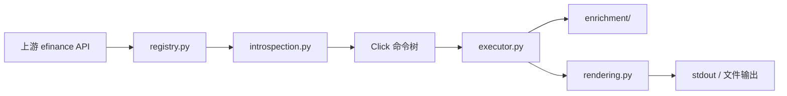

# efinance-cli

<div align="center">

<p><strong>面向 <code>efinance</code> Python 包的 Agent 友好型命令行工具</strong></p>

<p>
  将上游市场数据 API 暴露为可预测的命令树，
  将结果统一为 table / JSON / CSV / TSV，
  并在结果形状允许时叠加技术指标增强。
</p>

<table>
  <tr>
    <td><strong>Python</strong></td>
    <td><code>&gt;= 3.13</code></td>
    <td><strong>主入口</strong></td>
    <td><code>efinance</code>、<code>efi</code></td>
  </tr>
  <tr>
    <td><strong>核心依赖</strong></td>
    <td><code>click</code>、<code>efinance</code>、<code>pandas</code>、<code>vortezwohl</code></td>
    <td><strong>文档</strong></td>
    <td><code>README</code> + <code>i18n/</code></td>
  </tr>
</table>

</div>

这个项目不是一个简单的脚本拼接层，而是 `efinance` 上的命令行产品层。它把命令发现、参数反射、执行、渲染和数据增强拆成独立模块，以便保持对外能力稳定、可扩展、可维护。

## 为什么存在

`efinance` 本身已经提供了股票、基金、债券、期货、通用查询与工具类的丰富 Python API。问题不在“有没有能力”，而在“能不能稳定地在终端里操作”：

- API 函数不容易快速浏览。
- 不同返回类型需要不同展示规则。
- 上游新增或修改函数时，手工接线很容易碎裂。
- 轮询刷新需要对所有查询命令保持一致。
- 部分结果可以做技术指标增强，但前提是数据形状足够兼容。

`efinance-cli` 的目标就是把这些问题收敛成一个更适合人和 Agent 反复使用的终端接口。

## 一览

<table>
  <thead>
    <tr>
      <th>层</th>
      <th>职责</th>
    </tr>
  </thead>
  <tbody>
    <tr>
      <td><code>registry.py</code></td>
      <td>控制暴露的上游模块与函数，并附加命令元数据。</td>
    </tr>
    <tr>
      <td><code>introspection.py</code></td>
      <td>根据 Python 签名生成 Click 参数，并做轻量类型转换。</td>
    </tr>
    <tr>
      <td><code>executor.py</code></td>
      <td>执行命令请求、处理 watch 循环，并输出到终端或文件。</td>
    </tr>
    <tr>
      <td><code>rendering.py</code></td>
      <td>统一处理 DataFrame / Series / dict / list / tuple / set / dataclass / namedtuple 输出。</td>
    </tr>
    <tr>
      <td><code>enrichment/</code></td>
      <td>为兼容的历史、最新与实时结果添加技术指标。</td>
    </tr>
  </tbody>
</table>

## 安装

```bash
pip install efinance-cli
```

项目目标 Python 版本为 3.13+，运行时需要可用的上游 `efinance` 包。同时依赖 `pandas`，因为输出规范化和指标增强都以 DataFrame 作为核心数据形态。

如果你是从源码开发，先准备好项目环境，再根据项目元数据安装依赖。

## 快速开始

### 发现证券

```bash
efinance search 贵州茅台
efinance search PG --count 10 --format json
efinance search 腾讯 --market Hongkong
```

当你还不知道准确代码时，`search` 是最稳妥的入口。默认会优先使用本地搜索缓存，除非显式指定 `--no-cache`。

### 查询市场数据

```bash
efinance stock get-base-info 600519
efinance stock get-quote-history 600519 --beg 20250101 --end 20250501 --full
efinance fund get-base-info 161725
efinance common get-latest-quote 600519
```

### 原地刷新

```bash
efinance stock get-realtime-quotes --watch --interval 2
efinance watch --interval 5 stock get-realtime-quotes
```

顶层 `watch` 命令会把任意受支持的子命令包一层刷新循环，并统一转发刷新参数。适合对多个查询命令复用同一套刷新策略。

## 命令面

CLI 暴露的是上游 `efinance` 的一个精选子集。
命令名由 Python 函数名转换而来：把下划线替换成连字符。

- `get_quote_history` → `get-quote-history`
- `get_realtime_increase_rate` → `get-realtime-increase-rate`
- `get_realtime_quotes_by_fs` → `get-realtime-quotes-by-fs`

### 顶层命令

<table>
  <thead>
    <tr>
      <th>命令</th>
      <th>用途</th>
    </tr>
  </thead>
  <tbody>
    <tr>
      <td><code>search</code></td>
      <td>按关键字和可选市场条件搜索证券。</td>
    </tr>
    <tr>
      <td><code>watch</code></td>
      <td>为任意受支持的子命令包上刷新循环。</td>
    </tr>
    <tr>
      <td><code>stock</code></td>
      <td>股票市场查询。</td>
    </tr>
    <tr>
      <td><code>fund</code></td>
      <td>基金市场查询。</td>
    </tr>
    <tr>
      <td><code>bond</code></td>
      <td>债券市场查询。</td>
    </tr>
    <tr>
      <td><code>futures</code></td>
      <td>期货市场查询。</td>
    </tr>
    <tr>
      <td><code>common</code></td>
      <td>跨资产类型的共享查询入口。</td>
    </tr>
    <tr>
      <td><code>utils</code></td>
      <td>搜索与标识符工具。</td>
    </tr>
  </tbody>
</table>

### 模块命令组

<details open>
<summary><strong>stock</strong></summary>

- `get-all-company-performance`
- `get-all-report-dates`
- `get-base-info`
- `get-belong-board`
- `get-daily-billboard`
- `get-deal-detail`
- `get-history-bill`
- `get-latest-holder-number`
- `get-latest-ipo-info`
- `get-latest-quote`
- `get-members`
- `get-quote-history`
- `get-quote-snapshot`
- `get-realtime-quotes`
- `get-today-bill`
- `get-top10-stock-holder-info`

</details>

<details>
<summary><strong>fund</strong></summary>

- `get-base-info`
- `get-fund-codes`
- `get-fund-manager`
- `get-industry-distribution`
- `get-invest-position`
- `get-pdf-reports`
- `get-period-change`
- `get-public-dates`
- `get-quote-history`
- `get-quote-history-multi`
- `get-realtime-increase-rate`
- `get-types-percentage`

</details>

<details>
<summary><strong>bond</strong></summary>

- `get-all-base-info`
- `get-base-info`
- `get-deal-detail`
- `get-history-bill`
- `get-quote-history`
- `get-realtime-quotes`
- `get-today-bill`

</details>

<details>
<summary><strong>futures</strong></summary>

- `get-deal-detail`
- `get-futures-base-info`
- `get-quote-history`
- `get-realtime-quotes`

</details>

<details>
<summary><strong>common</strong></summary>

- `get-base-info`
- `get-deal-detail`
- `get-history-bill`
- `get-latest-quote`
- `get-quote-history`
- `get-realtime-quotes-by-fs`
- `get-today-bill`

</details>

<details>
<summary><strong>utils</strong></summary>

- `add-market`
- `get-quote-id`
- `search-quote`
- `search-quote-locally`

</details>

## 输出模型

所有命令都会经过统一输出层，支持四种输出模式：

<table>
  <thead>
    <tr>
      <th>格式</th>
      <th>适用场景</th>
      <th>行为</th>
    </tr>
  </thead>
  <tbody>
    <tr>
      <td><code>table</code></td>
      <td>终端阅读</td>
      <td>默认模式。对 DataFrame 类结果使用适合终端阅读的表格展示。</td>
    </tr>
    <tr>
      <td><code>json</code></td>
      <td>结构化下游处理</td>
      <td>把 DataFrame、Series、dict、dataclass、namedtuple 序列化为 JSON。</td>
    </tr>
    <tr>
      <td><code>csv</code></td>
      <td>落盘与互操作</td>
      <td>输出逗号分隔内容，并尊重索引与转置设置。</td>
    </tr>
    <tr>
      <td><code>tsv</code></td>
      <td>表格工具友好导出</td>
      <td>与 CSV 相同，但使用制表符分隔。</td>
    </tr>
  </tbody>
</table>

通用输出参数：

- `--full`
- `--transpose`
- `--no-index`
- `--limit N`
- `--output PATH`
- `--encoding utf-8`

这些参数会统一作用于整个命令树，不需要为每个模块重新学习一套输出规则。

## watch 模型

watch 支持由执行器统一实现，不需要为每个命令复制逻辑。

支持的命令可以直接原地刷新：

```bash
efinance stock get-realtime-quotes --watch --interval 2
```

或者由顶层 wrapper 包装：

```bash
efinance watch --interval 2 stock get-realtime-quotes
efinance watch --interval 10 fund get-realtime-increase-rate 161725 005827
```

通用 watch 参数：

- `--watch`
- `--interval FLOAT`
- `--count INT`
- `--clear / --no-clear`

当你希望对多个子命令复用同一套刷新策略时，`watch` wrapper 最实用。

## 技术指标增强

`enrichment/` 会在结果形状足够兼容时，为历史数据、最新快照和实时列表叠加技术指标。

### 指标等级

<table>
  <thead>
    <tr>
      <th>等级</th>
      <th>别名</th>
      <th>历史窗口</th>
      <th>实时上限</th>
      <th>典型用途</th>
    </tr>
  </thead>
  <tbody>
    <tr>
      <td><code>basic</code></td>
      <td><code>1</code></td>
      <td>60</td>
      <td>50</td>
      <td>核心均线和振荡类指标。</td>
    </tr>
    <tr>
      <td><code>advanced</code></td>
      <td><code>2</code></td>
      <td>120</td>
      <td>80</td>
      <td>趋势强度与通道类扩展。</td>
    </tr>
    <tr>
      <td><code>full</code></td>
      <td><code>3</code></td>
      <td>200</td>
      <td>120</td>
      <td>更完整的指标覆盖，包括一目均衡表、SAR、枢轴点、斐波那契、支撑/阻力等。</td>
    </tr>
  </tbody>
</table>

### 增强适用范围

- 股票、债券、期货、通用和基金历史 K 线结果。
- 股票快照、基础信息等单行结果。
- 最新行情结果。
- 实时列表结果，且会受配置限制。

增强逻辑是保守的。只有当结果能可靠映射到 OHLCV 结构时，才会增加指标列。若上游结果无法稳定对齐，CLI 会保留原始结果，不会强行改写。

### 会添加什么

项目内置了一组较完整的指标，按关注点分组如下：

- 趋势类：MACD、布林带、DMI / ADX、SuperTrend、一目均衡表、唐奇安通道、Keltner 通道、Aroon、抛物线 SAR
- 动量类：RSI、KDJ、ROC、CCI、PPO、TRIX、TSI、威廉指标
- 成交量类：OBV、MFI、CMF、PVT、VWAP、资金流向类指标、量比
- 波动率类：ATR、NATR、历史波动率、Chaikin 波动率、Mass Index
- 价格结构类：枢轴点、斐波那契回撤、滚动支撑/阻力
- 国内常见风格指标：BBI、BIAS、BRAR、CR、DMA、EMV、MTM、PSY、VR、ASI

## 推荐工作流

当你还不知道准确标识符时，先走发现路径：

```text
search -> get-quote-id -> 模块查询
```

这样可以减少关键字歧义，是自然语言意图转成可执行查询时最稳的路径。

## 项目架构

<details open>
<summary><strong>执行管线</strong></summary>



</details>

### 文件职责

<table>
  <thead>
    <tr>
      <th>文件 / 包</th>
      <th>职责</th>
    </tr>
  </thead>
  <tbody>
    <tr>
      <td><code>efinance_cli/main.py</code></td>
      <td>进程入口。</td>
    </tr>
    <tr>
      <td><code>efinance_cli/app.py</code></td>
      <td>应用装配。</td>
    </tr>
    <tr>
      <td><code>efinance_cli/commands.py</code></td>
      <td>根命令、模块命令组和顶层命令。</td>
    </tr>
    <tr>
      <td><code>efinance_cli/registry.py</code></td>
      <td>上游模块白名单、函数暴露和命令元数据。</td>
    </tr>
    <tr>
      <td><code>efinance_cli/introspection.py</code></td>
      <td>基于签名生成 Click 参数。</td>
    </tr>
    <tr>
      <td><code>efinance_cli/executor.py</code></td>
      <td>请求执行、watch 循环和结果输出。</td>
    </tr>
    <tr>
      <td><code>efinance_cli/rendering.py</code></td>
      <td>输出格式化和序列化。</td>
    </tr>
    <tr>
      <td><code>efinance_cli/enrichment/</code></td>
      <td>技术指标增强管线。</td>
    </tr>
    <tr>
      <td><code>efinance_cli/indicators/</code></td>
      <td>可复用的指标计算原语。</td>
    </tr>
  </tbody>
</table>

## 数据源说明

这个 CLI 的稳定性取决于它封装的上游市场数据源。
你应该默认认为这些场景会发生：

- 临时网络失败
- 上游限流
- 空响应
- 市场级别的局部故障

CLI 不会把这些失败“隐藏掉”，而是保持执行路径清晰，让你可以按需重试、降低刷新频率，或者切换到别的查询方式。

## 质量基线

仓库里包含最小烟雾测试，覆盖：

- 技术指标导出与形状
- basic / advanced / full 三档指标增强行为

这些测试不会追求验证每个指标的金融含义，而是优先守住命令层与增强层不出现静默回归的最小契约。

## 如何扩展

如果要扩展项目，最稳妥的路径是：

1. 在 `registry.py` 中增删上游暴露函数白名单。
2. 如果上游 docstring 不完整或不稳定，再补充或规范帮助文本。
3. 如果新参数类型需要新的转换规则，再修改 `introspection.py`。
4. 如果返回结果是新形态，再在 `rendering.py` 中新增渲染器。
5. 如果某类命令需要指标增强，再更新 `enrichment/`。
6. 为新增表面补充或更新烟雾测试。

这样可以把改动控制在局部，避免命令树退化成一个巨大的单文件。

## 其他语言文档

<table>
  <thead>
    <tr>
      <th>语言</th>
      <th>文件</th>
    </tr>
  </thead>
  <tbody>
    <tr>
      <td>简体中文</td>
      <td><a href="i18n/README.zh-CN.md">i18n/README.zh-CN.md</a></td>
    </tr>
    <tr>
      <td>繁體中文</td>
      <td><a href="i18n/README.zh-TW.md">i18n/README.zh-TW.md</a></td>
    </tr>
  </tbody>
</table>

## 进一步阅读

- [CLI 设计说明](docs/cli-设计与使用说明.md)
- [架构设计说明](docs/架构设计说明.md)

## 许可证

见 [LICENSE](LICENSE)。
