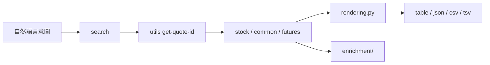
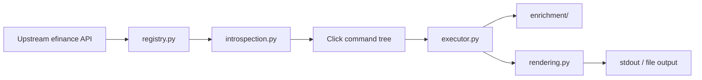

<div align="center">
  <h1>efinance-cli</h1>
  <p><strong>把 <code>efinance</code> 變成更適合人和 Agent 反覆調用的終端介面</strong></p>
  <p>顯式命令樹、統一輸出層、可重用刷新機制、按需疊加技術指標。</p>
  <p>
    <a href="https://www.python.org/"></a>
    <a href="https://pypi.org/project/click/"></a>
    <a href="https://pypi.org/project/efinance/"></a>
    <a href="https://pandas.pydata.org/"></a>
  </p>
  <p>
    <a href="#安裝">安裝</a> ·
    <a href="#語言版本">語言版本</a> ·
    <a href="#30-秒上手">30 秒上手</a> ·
    <a href="#美股示例">美股示例</a> ·
    <a href="#命令地圖">命令地圖</a> ·
    <a href="#技術指標增強">技術指標增強</a> ·
    <a href="#專案架構">專案架構</a>
  </p>
</div>

## 語言版本

<p align="center"><strong><a href="../README.md">English</a> | <a href="README.zh-CN.md">简体中文</a> | 繁體中文</strong></p>

<table>
  <tr>
    <td width="33%" valign="top">
      <strong>可預測</strong><br />
      命令名直接映射上游函式，適合快速檢索、腳本調用和 Agent 自動拼裝。
    </td>
    <td width="33%" valign="top">
      <strong>可消費</strong><br />
      所有結果統一落到 <code>table / json / csv / tsv</code>，不用為每類回傳值重新適配。
    </td>
    <td width="33%" valign="top">
      <strong>可擴充</strong><br />
      命令發現、參數反射、執行、渲染、指標增強相互解耦，便於局部演進。
    </td>
  </tr>
</table>

## 安裝

請從 PyPI 套件 `the-efinance-cli` 安裝。安裝完成後可使用 `efinance` 和 `efi` 兩個命令入口。

```bash
uv add -U the-efinance-cli
efinance --help
```

```bash
pip install -U the-efinance-cli
efinance --help
```

執行環境需求為 Python `3.10+`。

## 這是什麼

> `efinance-cli` 不是一組零散腳本，而是套在 `efinance` 之上的命令列產品層。

它把上游市場資料 API 收束成一棵顯式命令樹，並把命令發現、參數解析、執行調度、結果渲染、技術指標增強拆成獨立模組。目標不是「重新發明一個行情庫」，而是把既有能力變成更穩定、更可重複調用的終端介面。

## 30 秒上手

<table>
  <tr>
    <td width="33%" valign="top">
      <strong>1. 先搜標的</strong>
      <pre lang="bash"><code>efinance search AAPL --market US_stock --result-count 5 --format json</code></pre>
      當你只知道股票代碼或公司簡稱時，先走搜尋入口最穩。
    </td>
    <td width="33%" valign="top">
      <strong>2. 再拿 quote_id</strong>
      <pre lang="bash"><code>efinance utils get-quote-id AAPL</code></pre>
      常見美股會拿到類似 <code>105.AAPL</code> 這樣的統一標識。
    </td>
    <td width="33%" valign="top">
      <strong>3. 再做查詢</strong>
      <pre lang="bash"><code>efinance stock get-quote-history AAPL --market-type us_stock --beg 20250102 --end 20250501 --limit 20</code></pre>
      歷史 K 線、最新行情、導出檔案都可以沿著這條鏈路繼續走。
    </td>
  </tr>
</table>

## 為什麼不是直接用上游 API

<table>
  <tr>
    <td width="50%" valign="top">
      <strong>上游問題不在能力，而在操作一致性</strong>
      <ul>
        <li>函式面很大，終端裡不容易快速發現。</li>
        <li>不同回傳型別需要不同展示策略。</li>
        <li>即時刷新、導出、轉置、限行等橫切能力容易重複接線。</li>
        <li>適合疊加指標的結果，通常需要額外的資料形狀判斷。</li>
      </ul>
    </td>
    <td width="50%" valign="top">
      <strong>CLI 解決的是「穩定調用體驗」</strong>
      <ul>
        <li>把 API 能力變成可瀏覽的命令樹。</li>
        <li>把輸出規則收斂到統一渲染層。</li>
        <li>把 watch 邏輯做成通用執行器能力。</li>
        <li>把技術指標增強做成保守、可控的後處理步驟。</li>
      </ul>
    </td>
  </tr>
</table>

## 美股示例

<details open>
<summary><strong>發現與定位</strong></summary>

```bash
efinance search AAPL --market US_stock --result-count 5
efinance search NVDA --market US_stock --format json
efinance utils get-quote-id AAPL
```

</details>

<details open>
<summary><strong>歷史行情與導出</strong></summary>

```bash
efinance stock get-quote-history AAPL --market-type us_stock --beg 20250102 --end 20250501 --limit 20
efinance stock get-quote-history MSFT --market-type us_stock --beg 20250102 --end 20250501 --format csv --output msft-history.csv
efinance stock get-quote-history TSLA --market-type us_stock --beg 20250102 --end 20250501 --indicator-level advanced --full
```

</details>

<details open>
<summary><strong>最新行情與輪詢</strong></summary>

```bash
efinance common get-latest-quote 105.AAPL --format json
efinance watch --interval 5 common get-latest-quote 105.NVDA --format json
efinance common get-latest-quote 105.MSFT --format json --output msft-latest.json
```

</details>

<details>
<summary><strong>輸出控制</strong></summary>

```bash
efinance stock get-quote-history AAPL --market-type us_stock --beg 20250102 --end 20250501 --transpose
efinance stock get-quote-history AAPL --market-type us_stock --beg 20250102 --end 20250501 --no-index
efinance stock get-quote-history AAPL --market-type us_stock --beg 20250102 --end 20250501 --format tsv --output aapl.tsv
```

</details>

<blockquote>
  注意：即時行情命令是否穩定返回，取決於上游市場資料源狀態。CLI 會保留失敗資訊，不會把網路波動靜默吞掉。
</blockquote>

## 命令地圖

<table>
  <thead>
    <tr>
      <th align="left">頂層命令</th>
      <th align="left">定位</th>
      <th align="left">典型入口</th>
    </tr>
  </thead>
  <tbody>
    <tr>
      <td><code>search</code></td>
      <td>按關鍵字和市場列舉搜尋證券候選項。</td>
      <td>不知道精確標識符時的第一站。</td>
    </tr>
    <tr>
      <td><code>watch</code></td>
      <td>給任意受支援子命令包一層刷新迴圈。</td>
      <td>統一輪詢策略，而不是每條命令單獨記參數。</td>
    </tr>
    <tr>
      <td><code>stock</code></td>
      <td>股票相關查詢。</td>
      <td>K 線、快照、最新行情、資金流、股東資訊。</td>
    </tr>
    <tr>
      <td><code>fund</code></td>
      <td>基金相關查詢。</td>
      <td>淨值、估算漲跌、持倉分布、報告下載。</td>
    </tr>
    <tr>
      <td><code>bond</code></td>
      <td>債券相關查詢。</td>
      <td>基礎資訊、行情、歷史成交與資金流。</td>
    </tr>
    <tr>
      <td><code>futures</code></td>
      <td>期貨相關查詢。</td>
      <td>基礎資訊、即時行情、K 線與成交明細。</td>
    </tr>
    <tr>
      <td><code>common</code></td>
      <td>跨資產的共享查詢入口。</td>
      <td>適合已知 <code>quote_id</code> 時直接訪問。</td>
    </tr>
    <tr>
      <td><code>utils</code></td>
      <td>搜尋與標識符工具。</td>
      <td><code>search-quote</code>、<code>get-quote-id</code>、<code>add-market</code>。</td>
    </tr>
  </tbody>
</table>

<details open>
<summary><strong>模組命令組</strong></summary>

<table>
  <tr>
    <td width="33%" valign="top">
      <strong>stock</strong><br />
      <code>get-base-info</code><br />
      <code>get-latest-quote</code><br />
      <code>get-quote-history</code><br />
      <code>get-quote-snapshot</code><br />
      <code>get-realtime-quotes</code><br />
      <code>get-deal-detail</code><br />
      <code>get-history-bill</code><br />
      <code>get-today-bill</code><br />
      <code>get-top10-stock-holder-info</code><br />
      <code>get-all-company-performance</code>
    </td>
    <td width="33%" valign="top">
      <strong>fund</strong><br />
      <code>get-base-info</code><br />
      <code>get-fund-codes</code><br />
      <code>get-fund-manager</code><br />
      <code>get-industry-distribution</code><br />
      <code>get-invest-position</code><br />
      <code>get-pdf-reports</code><br />
      <code>get-period-change</code><br />
      <code>get-public-dates</code><br />
      <code>get-quote-history</code><br />
      <code>get-realtime-increase-rate</code>
    </td>
    <td width="33%" valign="top">
      <strong>bond / futures / common / utils</strong><br />
      <code>bond.get-base-info</code><br />
      <code>bond.get-quote-history</code><br />
      <code>futures.get-futures-base-info</code><br />
      <code>futures.get-quote-history</code><br />
      <code>common.get-latest-quote</code><br />
      <code>common.get-quote-history</code><br />
      <code>utils.search-quote</code><br />
      <code>utils.search-quote-locally</code><br />
      <code>utils.get-quote-id</code><br />
      <code>utils.add-market</code>
    </td>
  </tr>
</table>

</details>

## 輸出模型

<table>
  <thead>
    <tr>
      <th align="left">格式</th>
      <th align="left">適用場景</th>
      <th align="left">說明</th>
    </tr>
  </thead>
  <tbody>
    <tr>
      <td><code>table</code></td>
      <td>終端直接閱讀</td>
      <td>預設模式，適合 DataFrame 風格輸出。</td>
    </tr>
    <tr>
      <td><code>json</code></td>
      <td>Agent 下游處理</td>
      <td>適合繼續做結構化消費、存檔和管道傳遞。</td>
    </tr>
    <tr>
      <td><code>csv</code></td>
      <td>落盤和資料交換</td>
      <td>適合導入表格工具、腳本、分析流水線。</td>
    </tr>
    <tr>
      <td><code>tsv</code></td>
      <td>表格友好導出</td>
      <td>行為與 CSV 相同，但使用製表符分隔。</td>
    </tr>
  </tbody>
</table>

統一執行時選項：

- `--full`
- `--transpose`
- `--no-index`
- `--limit N`
- `--output PATH`
- `--encoding utf-8`

這組參數會貫穿整個命令樹，不需要在不同模組之間重新學習一套輸出規則。

## Watch 模型

<table>
  <tr>
    <td width="50%" valign="top">
      <strong>內聯 watch</strong>
      <pre lang="bash"><code>efinance common get-latest-quote 105.AAPL --watch --interval 5</code></pre>
    </td>
    <td width="50%" valign="top">
      <strong>頂層 wrapper</strong>
      <pre lang="bash"><code>efinance watch --interval 5 common get-latest-quote 105.AAPL --format json</code></pre>
    </td>
  </tr>
</table>

統一刷新參數：

- `--watch`
- `--interval FLOAT`
- `--count INT`
- `--clear / --no-clear`

## 技術指標增強

`enrichment/` 會在結果形狀足夠相容時，為歷史 K 線、最新行情、快照和部分即時列表疊加指標列。

<table>
  <thead>
    <tr>
      <th align="left">等級</th>
      <th align="left">別名</th>
      <th align="left">歷史窗口</th>
      <th align="left">即時上限</th>
      <th align="left">適合場景</th>
    </tr>
  </thead>
  <tbody>
    <tr>
      <td><code>basic</code></td>
      <td><code>1</code></td>
      <td>60</td>
      <td>50</td>
      <td>均線、RSI、KDJ、MACD 等基礎觀察。</td>
    </tr>
    <tr>
      <td><code>advanced</code></td>
      <td><code>2</code></td>
      <td>120</td>
      <td>80</td>
      <td>趨勢強度、通道類和更多動量指標。</td>
    </tr>
    <tr>
      <td><code>full</code></td>
      <td><code>3</code></td>
      <td>200</td>
      <td>120</td>
      <td>更大覆蓋面，包括 Ichimoku、SAR、樞軸點、斐波那契和支撐阻力。</td>
    </tr>
  </tbody>
</table>

內建指標大致分為幾組：

- 趨勢類：MACD、布林帶、DMI / ADX、SuperTrend、Ichimoku、Donchian、Keltner、Aroon、Parabolic SAR
- 動量類：RSI、KDJ、ROC、CCI、PPO、TRIX、TSI、Williams %R
- 成交量類：OBV、MFI、CMF、PVT、VWAP、Force Index、Volume Ratio
- 波動率類：ATR、NATR、Historical Volatility、Chaikin Volatility、Mass Index
- 價格結構類：Pivot Points、Fibonacci Retracement、Rolling Support / Resistance

## 適合 Agent 的調用路徑



推薦的穩定路徑是：

```text
search -> get-quote-id -> 模組查詢 -> 結構化輸出 / 檔案導出
```

## 專案架構

<details open>
<summary><strong>執行管線</strong></summary>



</details>

<table>
  <thead>
    <tr>
      <th align="left">檔案 / 包</th>
      <th align="left">職責</th>
    </tr>
  </thead>
  <tbody>
    <tr>
      <td><code>efinance_cli/main.py</code></td>
      <td>程序入口。</td>
    </tr>
    <tr>
      <td><code>efinance_cli/app.py</code></td>
      <td>應用裝配。</td>
    </tr>
    <tr>
      <td><code>efinance_cli/commands.py</code></td>
      <td>根命令、模組命令組、頂層命令。</td>
    </tr>
    <tr>
      <td><code>efinance_cli/registry.py</code></td>
      <td>可暴露上游能力的白名單與命令中繼資料。</td>
    </tr>
    <tr>
      <td><code>efinance_cli/introspection.py</code></td>
      <td>基於簽名自動推導 Click 參數。</td>
    </tr>
    <tr>
      <td><code>efinance_cli/executor.py</code></td>
      <td>執行請求、處理 watch 迴圈、發出結果。</td>
    </tr>
    <tr>
      <td><code>efinance_cli/rendering.py</code></td>
      <td>統一做輸出格式化與序列化。</td>
    </tr>
    <tr>
      <td><code>efinance_cli/enrichment/</code></td>
      <td>在相容結果上疊加技術指標。</td>
    </tr>
    <tr>
      <td><code>efinance_cli/indicators/</code></td>
      <td>可重用的指標計算原語。</td>
    </tr>
  </tbody>
</table>

## 資料源邊界

<table>
  <tr>
    <td width="50%" valign="top">
      <strong>這不是 CLI 自身能完全控制的部分</strong>
      <ul>
        <li>臨時網路失敗</li>
        <li>上游限流</li>
        <li>空響應</li>
        <li>市場級別的資料源波動</li>
      </ul>
    </td>
    <td width="50%" valign="top">
      <strong>CLI 的處理原則</strong>
      <ul>
        <li>不靜默吞掉失敗。</li>
        <li>保留錯誤路徑，便於重試與定位。</li>
        <li>把重試、降頻、切換查詢類型交給調用方決策。</li>
      </ul>
    </td>
  </tr>
</table>

## 擴展方式

如果你要擴展這個專案，推薦按下面的最小閉環推進：

1. 在 `registry.py` 裡增刪上游函式白名單或幫助文字。
2. 當出現新的參數類型，再調整 `introspection.py` 的推導與轉換規則。
3. 當出現新的結果形狀，再擴充 `rendering.py`。
4. 當某類資料應該具備指標增強，再進入 `enrichment/`。
5. 最後補充或更新對應的 smoke test。

## 品質基線

倉庫當前重點覆蓋兩類最小契約：

- 技術指標導出與結果形狀
- `basic / advanced / full` 三檔增強行為

目標不是驗證每一個金融指標本身的交易含義，而是盡量防止命令層和增強層出現靜默回歸。

## 相關文件

<table>
  <tr>
    <td width="50%" valign="top">
      <strong>設計說明</strong><br />
      <a href="../docs/cli-设计与使用说明.md">CLI 設計與使用說明</a><br />
      <a href="../docs/架构设计说明.md">架構設計說明</a>
    </td>
    <td width="50%" valign="top">
      <strong>入口</strong><br />
      <code>efinance</code><br />
      <code>efi</code>
    </td>
  </tr>
</table>

## License

See [../LICENSE](../LICENSE).
