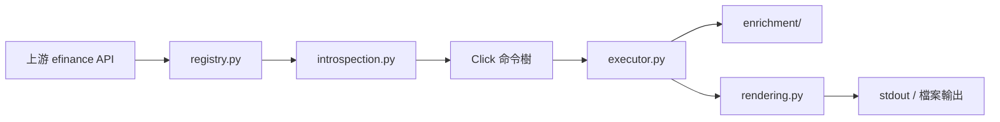

# efinance-cli

<div align="center">

<p><strong>面向 <code>efinance</code> Python 套件的 Agent 友善型命令列工具</strong></p>

<p>
  將上游市場資料 API 暴露為可預期的命令樹，
  將結果統一為 table / JSON / CSV / TSV，
  並在結果形狀允許時疊加技術指標增強。
</p>

<table>
  <tr>
    <td><strong>Python</strong></td>
    <td><code>&gt;= 3.13</code></td>
    <td><strong>主要入口</strong></td>
    <td><code>efinance</code>、<code>efi</code></td>
  </tr>
  <tr>
    <td><strong>核心依賴</strong></td>
    <td><code>click</code>、<code>efinance</code>、<code>pandas</code>、<code>vortezwohl</code></td>
    <td><strong>文件</strong></td>
    <td><code>README</code> + <code>i18n/</code></td>
  </tr>
</table>

</div>

這個專案不是一個簡單的腳本拼接層，而是 `efinance` 上的命令列產品層。它把命令探索、參數反射、執行、渲染與資料增強拆成獨立模組，以便維持對外能力穩定、可擴充、可維護。

## 為什麼存在

`efinance` 本身已經提供股票、基金、債券、期貨、通用查詢與工具類的豐富 Python API。問題不在「有沒有能力」，而在「能不能穩定地在終端裡操作」：

- API 函式不容易快速瀏覽。
- 不同回傳型別需要不同的展示規則。
- 上游新增或修改函式時，手工接線很容易碎裂。
- 輪詢刷新需要對所有查詢命令保持一致。
- 部分結果可以做技術指標增強，但前提是資料形狀足夠相容。

`efinance-cli` 的目標就是把這些問題收斂成一個更適合人與 Agent 反覆使用的終端介面。

## 一覽

<table>
  <thead>
    <tr>
      <th>層</th>
      <th>職責</th>
    </tr>
  </thead>
  <tbody>
    <tr>
      <td><code>registry.py</code></td>
      <td>控制暴露的上游模組與函式，並附加命令中繼資料。</td>
    </tr>
    <tr>
      <td><code>introspection.py</code></td>
      <td>根據 Python 簽名生成 Click 參數，並做輕量型別轉換。</td>
    </tr>
    <tr>
      <td><code>executor.py</code></td>
      <td>執行命令請求、處理 watch 迴圈，並輸出到終端或檔案。</td>
    </tr>
    <tr>
      <td><code>rendering.py</code></td>
      <td>統一處理 DataFrame / Series / dict / list / tuple / set / dataclass / namedtuple 輸出。</td>
    </tr>
    <tr>
      <td><code>enrichment/</code></td>
      <td>為相容的歷史、最新與即時結果加入技術指標。</td>
    </tr>
  </tbody>
</table>

## 安裝

```bash
pip install efinance-cli
```

專案目標 Python 版本為 3.13+，執行時需要可用的上游 `efinance` 套件。同時依賴 `pandas`，因為輸出正規化與指標增強都以 DataFrame 作為核心資料形態。

如果你是從原始碼開發，先準備好專案環境，再依據專案中繼資料安裝依賴。

## 快速開始

### 發現證券

```bash
efinance search 贵州茅台
efinance search PG --count 10 --format json
efinance search 腾讯 --market Hongkong
```

當你還不知道準確代碼時，`search` 是最穩妥的入口。預設會優先使用本地搜尋快取，除非顯式指定 `--no-cache`。

### 查詢市場資料

```bash
efinance stock get-base-info 600519
efinance stock get-quote-history 600519 --beg 20250101 --end 20250501 --full
efinance fund get-base-info 161725
efinance common get-latest-quote 600519
```

### 原地刷新

```bash
efinance stock get-realtime-quotes --watch --interval 2
efinance watch --interval 5 stock get-realtime-quotes
```

頂層 `watch` 命令會把任意受支援的子命令包上一層刷新迴圈，並統一轉發刷新參數。適合對多個查詢命令重用同一套刷新策略。

## 命令面

CLI 暴露的是上游 `efinance` 的精選子集。
命令名稱由 Python 函式名轉換而來：把底線替換成連字號。

- `get_quote_history` → `get-quote-history`
- `get_realtime_increase_rate` → `get-realtime-increase-rate`
- `get_realtime_quotes_by_fs` → `get-realtime-quotes-by-fs`

### 頂層命令

<table>
  <thead>
    <tr>
      <th>命令</th>
      <th>用途</th>
    </tr>
  </thead>
  <tbody>
    <tr>
      <td><code>search</code></td>
      <td>依關鍵字與可選市場條件搜尋證券。</td>
    </tr>
    <tr>
      <td><code>watch</code></td>
      <td>為任意受支援的子命令包上刷新迴圈。</td>
    </tr>
    <tr>
      <td><code>stock</code></td>
      <td>股票市場查詢。</td>
    </tr>
    <tr>
      <td><code>fund</code></td>
      <td>基金市場查詢。</td>
    </tr>
    <tr>
      <td><code>bond</code></td>
      <td>債券市場查詢。</td>
    </tr>
    <tr>
      <td><code>futures</code></td>
      <td>期貨市場查詢。</td>
    </tr>
    <tr>
      <td><code>common</code></td>
      <td>跨資產類型的共享查詢入口。</td>
    </tr>
    <tr>
      <td><code>utils</code></td>
      <td>搜尋與識別碼工具。</td>
    </tr>
  </tbody>
</table>

### 模組命令群組

<details open>
<summary><strong>stock</strong></summary>

- `get-all-company-performance`
- `get-all-report-dates`
- `get-base-info`
- `get-belong-board`
- `get-daily-billboard`
- `get-deal-detail`
- `get-history-bill`
- `get-latest-holder-number`
- `get-latest-ipo-info`
- `get-latest-quote`
- `get-members`
- `get-quote-history`
- `get-quote-snapshot`
- `get-realtime-quotes`
- `get-today-bill`
- `get-top10-stock-holder-info`

</details>

<details>
<summary><strong>fund</strong></summary>

- `get-base-info`
- `get-fund-codes`
- `get-fund-manager`
- `get-industry-distribution`
- `get-invest-position`
- `get-pdf-reports`
- `get-period-change`
- `get-public-dates`
- `get-quote-history`
- `get-quote-history-multi`
- `get-realtime-increase-rate`
- `get-types-percentage`

</details>

<details>
<summary><strong>bond</strong></summary>

- `get-all-base-info`
- `get-base-info`
- `get-deal-detail`
- `get-history-bill`
- `get-quote-history`
- `get-realtime-quotes`
- `get-today-bill`

</details>

<details>
<summary><strong>futures</strong></summary>

- `get-deal-detail`
- `get-futures-base-info`
- `get-quote-history`
- `get-realtime-quotes`

</details>

<details>
<summary><strong>common</strong></summary>

- `get-base-info`
- `get-deal-detail`
- `get-history-bill`
- `get-latest-quote`
- `get-quote-history`
- `get-realtime-quotes-by-fs`
- `get-today-bill`

</details>

<details>
<summary><strong>utils</strong></summary>

- `add-market`
- `get-quote-id`
- `search-quote`
- `search-quote-locally`

</details>

## 輸出模型

所有命令都會經過統一輸出層，支援四種輸出模式：

<table>
  <thead>
    <tr>
      <th>格式</th>
      <th>適用場景</th>
      <th>行為</th>
    </tr>
  </thead>
  <tbody>
    <tr>
      <td><code>table</code></td>
      <td>終端閱讀</td>
      <td>預設模式。對 DataFrame 類結果使用適合終端閱讀的表格展示。</td>
    </tr>
    <tr>
      <td><code>json</code></td>
      <td>結構化下游處理</td>
      <td>把 DataFrame、Series、dict、dataclass、namedtuple 序列化為 JSON。</td>
    </tr>
    <tr>
      <td><code>csv</code></td>
      <td>落盤與互通</td>
      <td>輸出逗號分隔內容，並尊重索引與轉置設定。</td>
    </tr>
    <tr>
      <td><code>tsv</code></td>
      <td>表格工具友善匯出</td>
      <td>與 CSV 相同，但使用定位字元分隔。</td>
    </tr>
  </tbody>
</table>

通用輸出參數：

- `--full`
- `--transpose`
- `--no-index`
- `--limit N`
- `--output PATH`
- `--encoding utf-8`

這些參數會統一作用於整個命令樹，不需要為每個模組重新學一套輸出規則。

## watch 模型

watch 支援由執行器統一實作，不需要為每個命令複製邏輯。

支援的命令可以直接原地刷新：

```bash
efinance stock get-realtime-quotes --watch --interval 2
```

或者由頂層 wrapper 包裝：

```bash
efinance watch --interval 2 stock get-realtime-quotes
efinance watch --interval 10 fund get-realtime-increase-rate 161725 005827
```

通用 watch 參數：

- `--watch`
- `--interval FLOAT`
- `--count INT`
- `--clear / --no-clear`

當你希望對多個子命令重用同一套刷新策略時，`watch` wrapper 最實用。

## 技術指標增強

`enrichment/` 會在結果形狀足夠相容時，為歷史資料、最新快照與即時列表疊加技術指標。

### 指標等級

<table>
  <thead>
    <tr>
      <th>等級</th>
      <th>別名</th>
      <th>歷史視窗</th>
      <th>即時上限</th>
      <th>典型用途</th>
    </tr>
  </thead>
  <tbody>
    <tr>
      <td><code>basic</code></td>
      <td><code>1</code></td>
      <td>60</td>
      <td>50</td>
      <td>核心均線與振盪類指標。</td>
    </tr>
    <tr>
      <td><code>advanced</code></td>
      <td><code>2</code></td>
      <td>120</td>
      <td>80</td>
      <td>趨勢強度與通道類擴展。</td>
    </tr>
    <tr>
      <td><code>full</code></td>
      <td><code>3</code></td>
      <td>200</td>
      <td>120</td>
      <td>更完整的指標覆蓋，包括一目均衡表、SAR、樞軸點、斐波那契、支撐/阻力等。</td>
    </tr>
  </tbody>
</table>

### 增強適用範圍

- 股票、債券、期貨、通用與基金歷史 K 線結果。
- 股票快照、基礎資訊等單行結果。
- 最新行情結果。
- 即時列表結果，且會受配置限制。

增強邏輯是保守的。只有當結果能可靠對應到 OHLCV 結構時，才會增加指標欄位。若上游結果無法穩定對齊，CLI 會保留原始結果，不會強行改寫。

### 會加入什麼

專案內建一組較完整的指標，按關注點分組如下：

- 趨勢類：MACD、布林帶、DMI / ADX、SuperTrend、一目均衡表、唐奇安通道、Keltner 通道、Aroon、拋物線 SAR
- 動量類：RSI、KDJ、ROC、CCI、PPO、TRIX、TSI、威廉指標
- 成交量類：OBV、MFI、CMF、PVT、VWAP、資金流向類指標、量比
- 波動率類：ATR、NATR、歷史波動率、Chaikin 波動率、Mass Index
- 價格結構類：樞軸點、斐波那契回撤、滾動支撐/阻力
- 國內常見風格指標：BBI、BIAS、BRAR、CR、DMA、EMV、MTM、PSY、VR、ASI

## 建議工作流

當你還不知道準確識別碼時，先走發現路徑：

```text
search -> get-quote-id -> 模組查詢
```

這樣可以減少關鍵字歧義，是自然語言意圖轉成可執行查詢時最穩的路徑。

## 專案架構

<details open>
<summary><strong>執行管線</strong></summary>



</details>

### 檔案職責

<table>
  <thead>
    <tr>
      <th>檔案 / 套件</th>
      <th>職責</th>
    </tr>
  </thead>
  <tbody>
    <tr>
      <td><code>efinance_cli/main.py</code></td>
      <td>程序入口。</td>
    </tr>
    <tr>
      <td><code>efinance_cli/app.py</code></td>
      <td>應用組裝。</td>
    </tr>
    <tr>
      <td><code>efinance_cli/commands.py</code></td>
      <td>根命令、模組命令群組與頂層命令。</td>
    </tr>
    <tr>
      <td><code>efinance_cli/registry.py</code></td>
      <td>上游模組白名單、函式暴露與命令中繼資料。</td>
    </tr>
    <tr>
      <td><code>efinance_cli/introspection.py</code></td>
      <td>以簽名生成 Click 參數。</td>
    </tr>
    <tr>
      <td><code>efinance_cli/executor.py</code></td>
      <td>請求執行、watch 迴圈與結果輸出。</td>
    </tr>
    <tr>
      <td><code>efinance_cli/rendering.py</code></td>
      <td>輸出格式化與序列化。</td>
    </tr>
    <tr>
      <td><code>efinance_cli/enrichment/</code></td>
      <td>技術指標增強管線。</td>
    </tr>
    <tr>
      <td><code>efinance_cli/indicators/</code></td>
      <td>可重用的指標計算原語。</td>
    </tr>
  </tbody>
</table>

## 資料源說明

這個 CLI 的穩定性取決於它封裝的上游市場資料源。
你應該預設這些情境會發生：

- 暫時性網路失敗
- 上游限流
- 空回應
- 市場級別的局部故障

CLI 不會把這些失敗「藏起來」，而是保持執行路徑清楚，讓你可以依需要重試、降低刷新頻率，或者切換到別的查詢方式。

## 品質基線

倉庫中包含最小煙霧測試，覆蓋：

- 技術指標導出與形狀
- basic / advanced / full 三檔指標增強行為

這些測試不追求驗證每個指標的金融意義，而是優先守住命令層與增強層不發生靜默回歸的最小契約。

## 如何擴充

如果要擴充專案，最穩妥的路徑是：

1. 在 `registry.py` 中增刪上游暴露函式白名單。
2. 如果上游 docstring 不完整或不穩定，再補充或規範說明文字。
3. 如果新參數型別需要新的轉換規則，再修改 `introspection.py`。
4. 如果回傳結果是新形態，再在 `rendering.py` 中新增渲染器。
5. 如果某類命令需要指標增強，再更新 `enrichment/`。
6. 為新增表面補充或更新煙霧測試。

這樣可以把改動控制在局部，避免命令樹退化成一個巨大的單檔案。

## 其他語言文件

<table>
  <thead>
    <tr>
      <th>語言</th>
      <th>檔案</th>
    </tr>
  </thead>
  <tbody>
    <tr>
      <td>簡體中文</td>
      <td><a href="i18n/README.zh-CN.md">i18n/README.zh-CN.md</a></td>
    </tr>
    <tr>
      <td>繁體中文</td>
      <td><a href="i18n/README.zh-TW.md">i18n/README.zh-TW.md</a></td>
    </tr>
  </tbody>
</table>

## 延伸閱讀

- [CLI 設計說明](docs/cli-设计与使用说明.md)
- [架構設計說明](docs/架构设计说明.md)

## 授權

見 [LICENSE](LICENSE)。
